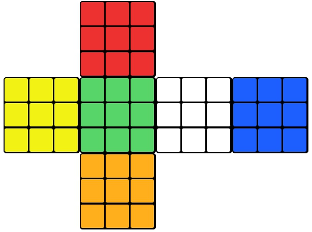

# Rubik's Cube Solver by hokkyss

## REQUIREMENTS

- [Nodejs](https://nodejs.org/en/download/) at least 12.19.0

## FIRST SETUP ONLY

```install dependencies
./setup
```

## AFTER FIRST SETUP

```bash
./run
```

## IMPORTANT INFORMATIONS

### Square Numbering

```
_  _  _  00 01 02  _  _  _  _  _  _
_  _  _  03 04 05  _  _  _  _  _  _
_  _  _  06 07 08  _  _  _  _  _  _
09 10 11 18 19 20 27 28 29 36 37 38
12 13 14 21 22 23 30 31 32 39 40 41
15 16 17 24 25 26 33 34 35 42 43 44
_  _  _  45 46 47  _  _  _  _  _  _
_  _  _  48 49 50  _  _  _  _  _  _
_  _  _  51 52 53  _  _  _  _  _  _
```

### Face Positions

```
_ U _ _
L F R B
_ D _ _
```

### Face Representations

```
U = Up
D = Down
L = Left
R = Right
F = Front
B = Back
```

### Color Representations

```
RED: R
ORANGE: O
BLUE: B
GREEN: G
WHITE: W
YELLOW: Y
```

[Refer to this document.](./INFORMATIONS)

## INPUT FORMAT

```
A one line string. Each character is one of color representations.
The i-th character is the color for i-th square.
```

## INPUT EXAMPLE

```
RRRRRRRRRYYYYYYYYYGGGGGGGGGWWWWWWWWWBBBBBBBBBOOOOOOOOO
```

Translates to


## ALGORITHM

This rubik solver uses A\* algorithm.

The number of configurations that can be generated is enormous. Because of that, using bruteforce is not a good idea. There is a big characteristic that leads to using A\*, that is the already known goal state.

A\* is an optimized version of Breadth First Search (BFS). The nodes processed are the nodes with the most little total costs. In this case, the total cost is

```
number of moves already used + number of unarranged blocks
```

with the limitations being case dependent and takes much time.

The time complexity of this algorithm is

```
O(13^m)
```

with m the number of moves done.
The number 13 comes from the average number of moves possible, being

- 15 moves possible after F, F', or F2
- 12 moves possible after B, B', or B2
- 15 moves possible after R, R', or R2
- 12 moves possible after L, L', or L2
- 15 moves possible after U, U', or U2
- 12 moves possible after D, D', or D2

## REFERENCES AND FRAMEWORKS

### References

- [Design and Interactions](https://rubiks-cube-solver.com/)
- [Theoretical understandings](https://medium.com/@benjamin.botto/implementing-an-optimal-rubiks-cube-solver-using-korf-s-algorithm-bf750b332cf9)

### Framework

> This is a [Next.js](https://nextjs.org/) project bootstrapped with [`create-next-app`](https://github.com/vercel/next.js/tree/canary/packages/create-next-app).
